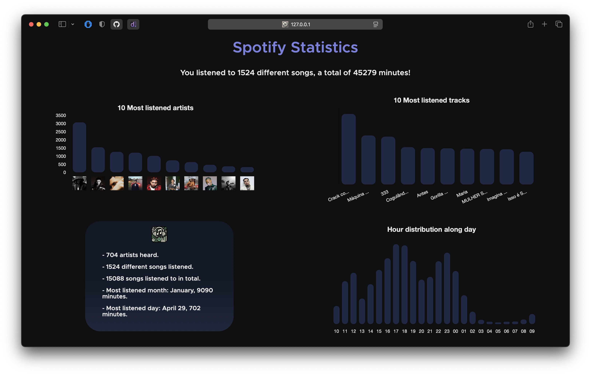

# Spotify_Analysis

A small project to keep track of my **Spotify Wrapped**. The goal of this project is to automate the process of storing the songs I’ve recently listened to on Spotify and, with that database in place, get stats about what I listen to. 

Here are the steps if you want to create your own Wrapped:

## Automate Recently Played Tracks Storing

The best way I found to store my **Spotify History** was use the [IFTTT](https://ifttt.com/explore) service, which allow us to save each **track** we listen to in a **Google Sheet**. 

Use this [IFTTT Applet](https://ifttt.com/applets/nin7BxVm-keep-a-log-of-your-recently-played-tracks) and connect it with your **Google Sheets** account.

**Note:** it starts saving your history from now on, so you don't have any information about the songs you listened to before.

*(IFTTT has a limit of 2000 rows per sheet, so I'm going to figure out how to automate this "problem" and save my songs without a limit, publishing it here.)*

## Python Script

```python
WRAP = "link-to-your-google-sheet"
```

Make sure to change the spreedsheet visibility to **public** and update the `WRAP` variable in `SpotifyWrapped.py`.

Doing that, our script will convert the spreedsheet to `DataFrame` and it starts the data analysis.

I don't have much else to say, so you can change the code to suit your needs.

**Note:** I have no problem with my Google Sheet being public, so I'll leave it there if you want to know what the site looks like with some data.

## WebSite frontend

I'm not an expert in frontend scenarios, but I thought it would be fun to make Statistics more readable and beautiful with a simple interface.

The **challenge** now is to find a way to run my python script every time I refresh the page, rather than manually running it every time I want to update my statistics.

### Artists Images

Since we don't have direct access to Spotify data, it's important to note that the artist images seen in the first chart were manually downloaded to track my track history, so you may need to do this for your favorite artists. If you don't want to, no problem, the artist's name is still available.

Save it in the `src/Images/` folder with the exact name of the artist.

## Final Output
At least for now...




## Important

It is important to note that this interface is intended for personal use only and should not be shared publicly due to copyright issues, both from Spotify and the artists.